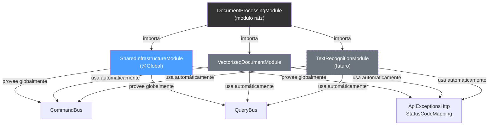

# Shared Infrastructure en LegalVec — Guía Completa

## El Problema

En el proyecto PHP (CodelyTV), Symfony tiene un **Kernel** que escanea automáticamente la carpeta `src/` y registra todos los servicios en un contenedor global. No necesitas declarar nada manualmente.

NestJS **no tiene esa funcionalidad**. Cada servicio debe registrarse explícitamente en un `@Module()`. Si no lo registras, NestJS no sabe que existe.

Esto genera la pregunta: **¿dónde registro los servicios compartidos para que todos los Bounded Contexts los usen?**

---

## La Solución: `SharedInfrastructureModule`

```
src/Shared/Infrastructure/NestJS/SharedInfrastructureModule.ts
```

Un módulo `@Global()` que se importa **una sola vez** en el módulo raíz y hace que sus exports estén disponibles en toda la aplicación — sin necesidad de importarlo en cada feature module.

```typescript
@Global()
@Module({
    imports: [CqrsModule],
    providers: [ApiExceptionsHttpStatusCodeMapping],
    exports: [CqrsModule, ApiExceptionsHttpStatusCodeMapping],
})
export class SharedInfrastructureModule {}
```

### ¿Por qué `@Global()`?

Sin `@Global()`, cada feature module tendría que importar `SharedInfrastructureModule` manualmente:

```typescript
// ❌ Sin @Global() — hay que repetirlo en CADA módulo
@Module({ imports: [CqrsModule, SharedInfrastructureModule] })
export class VectorizedDocumentModule {}

@Module({ imports: [CqrsModule, SharedInfrastructureModule] })
export class TextRecognitionModule {}

@Module({ imports: [CqrsModule, SharedInfrastructureModule] })
export class DeleteDocumentModule {}
```

Con `@Global()`, solo se registra una vez en el módulo raíz:

```typescript
// ✅ Con @Global() — solo aquí, una vez
@Module({
    imports: [SharedInfrastructureModule, VectorizedDocumentModule, ...]
})
export class DocumentProcessingModule {}

// Los feature modules quedan limpios:
@Module({ controllers: [...], providers: [...] })
export class VectorizedDocumentModule {}
```

---

## Comparación PHP/Symfony vs NestJS

### Cómo funciona en Symfony

```yaml
# services.yaml — Symfony escanea src/ y registra TODO automáticamente
services:
    _defaults:
        autowire: true
        autoconfigure: true

    App\:
        resource: '../src/'   # ← escanea todas las clases automáticamente
```

Resultado: **cualquier clase** con type-hints en su constructor se inyecta automáticamente. No declaras nada.

### Cómo funciona en NestJS

```typescript
// Debes declarar explícitamente cada provider en un @Module()
@Module({
    providers: [ApiExceptionsHttpStatusCodeMapping],  // ← registro explícito
    exports: [ApiExceptionsHttpStatusCodeMapping],
})
```

> [!IMPORTANT]
> En NestJS no existe autodescubrimiento nativo. Existen paquetes de la comunidad (`nestjs-dynamic-providers`, `nestjs-autoloader`), pero son poco mantenidos y rompen la filosofía del framework. **El registro explícito es una fortaleza, no una limitación** — te da un grafo de dependencias predecible y debuggeable.

---

## ¿Qué va en el módulo y qué NO?

Esta es la regla clave. De todo lo que existe en `Shared/`, **solo una fracción mínima** se registra como provider.

### ❌ NO va en el módulo (la mayoría)

| Tipo | Ejemplo | Por qué NO |
|---|---|---|
| Interfaces | `CommandBus`, `Query`, `Logger` | Se importan con `import`, no se inyectan |
| Value Objects | `Uuid`, `Email`, `StringValueObject` | Se instancian con `new`, no con DI |
| Clases abstractas | `ApiController`, `AggregateRoot` | Se usan por herencia, no por inyección |
| Errores de dominio | `DocumentNotFound`, `InvalidArgument` | Se lanzan con `throw`, no se inyectan |
| Utilidades puras | `Assert`, `Utils`, `Collection` | Son funciones/clases estáticas |
| DTOs | `VectorizeDocumentCommand` | Son objetos simples, se instancian con `new` |

### ✅ SÍ va en el módulo (pocos)

| Tipo | Ejemplo | Por qué SÍ |
|---|---|---|
| Servicios `@Injectable()` | `ApiExceptionsHttpStatusCodeMapping` | NestJS necesita instanciarlos y gestionar su ciclo de vida |
| Implementaciones de interfaces | `WinstonLogger implements Logger` | Se vinculan con `{ provide, useClass }` para poder intercambiarlas |
| Módulos externos | `CqrsModule` | Se re-exportan para que los feature modules los reciban |

### Ejemplo con el árbol completo del PHP

Si tuvieras **toda** la estructura del proyecto PHP:

```
src/Shared/
├── Domain/           (~30 archivos)  →  0 van en el módulo
└── Infrastructure/   (~30 archivos)  →  ~6-7 van en el módulo
```

El módulo quedaría así:

```typescript
@Global()
@Module({
    imports: [CqrsModule],
    providers: [
        ApiExceptionsHttpStatusCodeMapping,           // ya existe
        // { provide: 'Logger', useClass: WinstonLogger },
        // { provide: 'UuidGenerator', useClass: CryptoUuidGenerator },
        // { provide: 'Monitoring', useClass: PrometheusMonitor },
        // { provide: 'RandomNumberGenerator', useClass: CryptoRandomGenerator },
    ],
    exports: [
        CqrsModule,
        ApiExceptionsHttpStatusCodeMapping,
        // 'Logger',
        // 'UuidGenerator',
        // 'Monitoring',
        // 'RandomNumberGenerator',
    ],
})
export class SharedInfrastructureModule {}
```

> [!TIP]
> Aunque `Shared/` crezca a 60+ archivos, el módulo siempre tendrá ~6-10 líneas de providers. La mayoría de archivos son interfaces, value objects y clases puras que **nunca necesitan registro**.

---

## Flexibilidad: Intercambiar Implementaciones

### El patrón `provide` / `useClass`

Exactamente igual que en Symfony con `services.yaml`, puedes cambiar la implementación de cualquier servicio modificando **una sola línea**:

```typescript
// 1. Define el contrato (Domain)
// src/Shared/Domain/Logger.ts
export interface Logger {
    info(message: string): void;
    error(message: string): void;
}

// 2. Crea implementaciones (Infrastructure)
// src/Shared/Infrastructure/WinstonLogger.ts
@Injectable()
export class WinstonLogger implements Logger { ... }

// src/Shared/Infrastructure/PinoLogger.ts
@Injectable()
export class PinoLogger implements Logger { ... }

// 3. Vincula en el módulo — AQUÍ decides cuál usar
{ provide: 'Logger', useClass: WinstonLogger }
// Cambiar a Pino? Solo modifica esta línea:
// { provide: 'Logger', useClass: PinoLogger }

// 4. El consumidor NUNCA cambia
constructor(@Inject('Logger') private readonly logger: Logger) {}
```

### Comparación directa

| Acción | Symfony (PHP) | NestJS (TypeScript) |
|---|---|---|
| Definir contrato | `interface Logger` | `interface Logger` |
| Crear implementación | `class MonologLogger implements Logger` | `class WinstonLogger implements Logger` |
| Vincular interfaz→impl | 1 línea en `services.yaml` | 1 línea en `{ provide, useClass }` |
| Cambiar implementación | Cambiar 1 línea en yaml | Cambiar 1 línea en el módulo |
| Inyectar en consumidor | Type-hint en constructor | `@Inject()` en constructor |
| Verificación en compilación | ❌ PHP no verifica | ✅ TypeScript verifica tipos |

> [!NOTE]
> TypeScript tiene una ventaja sobre PHP aquí: si la nueva implementación no cumple la interfaz, **el compilador te avisa antes de ejecutar**. En PHP, el error ocurre en runtime.

---

## Flujo de Dependencias



---

## Cómo Agregar un Nuevo Servicio Compartido

### Paso a paso

```bash
# 1. Crear la interfaz en Domain (contrato puro)
src/Shared/Domain/Logger.ts

# 2. Crear la implementación en Infrastructure
src/Shared/Infrastructure/WinstonLogger.ts

# 3. Registrar en SharedInfrastructureModule (2 líneas)
```

```diff
 @Global()
 @Module({
     imports: [CqrsModule],
     providers: [
         ApiExceptionsHttpStatusCodeMapping,
+        { provide: 'Logger', useClass: WinstonLogger },
     ],
     exports: [
         CqrsModule,
         ApiExceptionsHttpStatusCodeMapping,
+        'Logger',
     ],
 })
 export class SharedInfrastructureModule {}
```

```bash
# 4. Usar en cualquier parte de la app (ya está disponible globalmente)
```

```typescript
constructor(@Inject('Logger') private readonly logger: Logger) {}
```

> [!TIP]
> No necesitas tocar ningún feature module. `@Global()` se encarga de distribuir el nuevo servicio automáticamente.

---

## Resumen

| Pregunta | Respuesta |
|---|---|
| ¿Dónde registro servicios compartidos? | En `SharedInfrastructureModule` |
| ¿Tengo que importarlo en cada feature module? | No — es `@Global()`, basta con importarlo en el módulo raíz |
| ¿El módulo crecerá mucho? | No — solo ~6-10 providers aunque Shared tenga 60+ archivos |
| ¿Tengo la misma flexibilidad que en PHP? | Sí — `{ provide, useClass }` es equivalente a `services.yaml` |
| ¿Existe autodescubrimiento en NestJS? | No nativo. Los paquetes de la comunidad no se recomiendan |
| ¿Es un problema? | No — el registro explícito es predecible y debuggeable |
